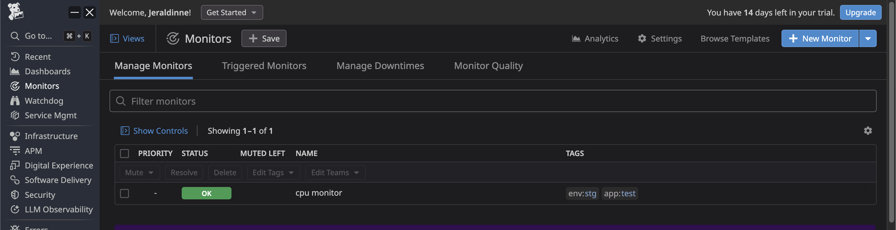
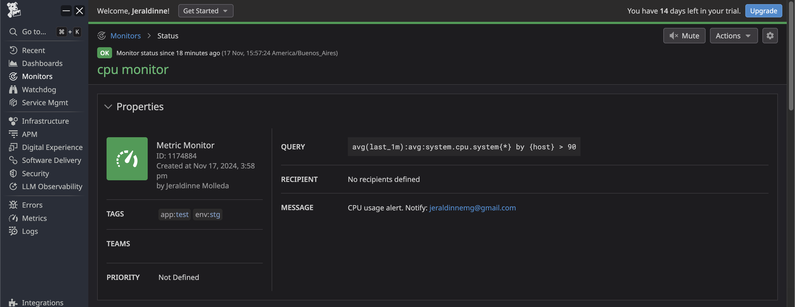
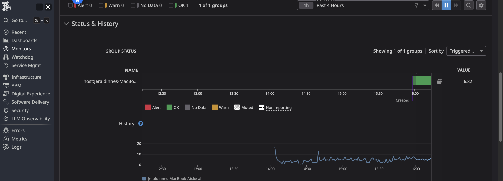
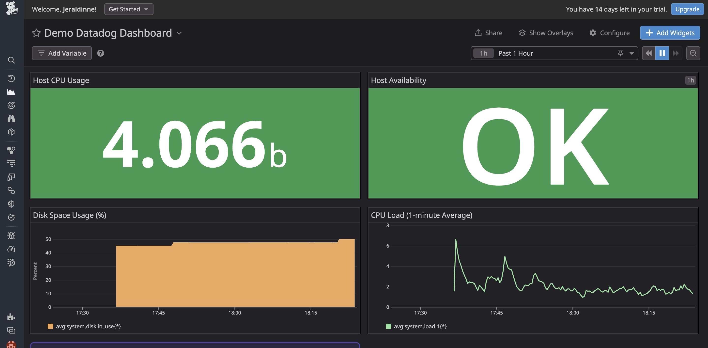

# Datadog & Terraform Integration

This repository demonstrates how to use Terraform to deploy a **Datadog monitor** for monitoring CPU usage and integrate it with **Azure Key Vault** to securely manage Datadog API and application keys.

## Overview

This Terraform configuration creates a Datadog monitor that triggers an alert when the CPU usage exceeds a specified threshold. The API and application keys are stored securely in an **Azure Key Vault** and are accessed dynamically during the deployment.

The project consists of the following main components:
1. **Terraform Providers**: `azurerm` for Azure resources and `datadog` for Datadog resources.
2. **Azure Key Vault**: Securely stores Datadog API and application keys.
3. **Datadog Monitor**: A Datadog CPU usage monitor that triggers an alert when the CPU usage exceeds the set thresholds.

## Datadog + terraform integration demo 
- Datadog monitor created

- Datadog monitor alert details

- Datadog metric

- Datadog dashboard

## Key Links
Some of the resources used:
- **Datadog Documentation**: [Datadog Documentation](https://www.datadoghq.com/blog/managing-datadog-with-terraform/)
- **Terraform Datadog Provider Documentation**: [Terraform Datadog Provider](https://registry.terraform.io/providers/datadog/datadog/latest/docs)
- **Terraform Azure Provider Documentation**: [Terraform Azure Provider](https://registry.terraform.io/providers/hashicorp/azurerm/latest/docs)
- **Azure Key Vault Documentation**: [Azure Key Vault Documentation](https://learn.microsoft.com/en-us/azure/key-vault/general/)

